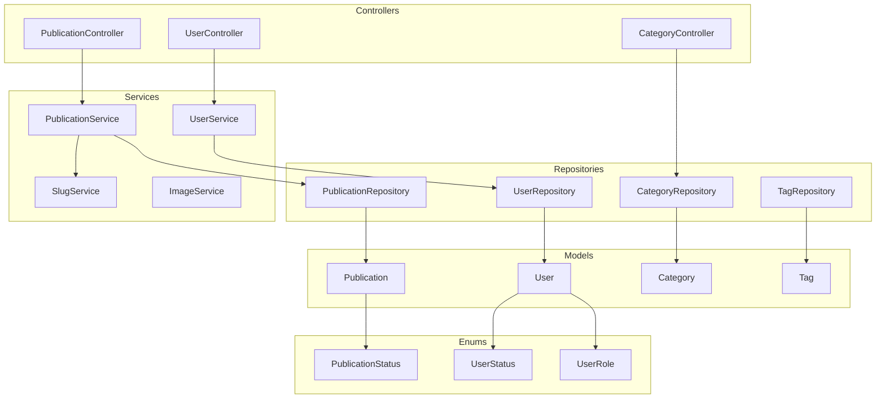

# Design Document: Architecture Refactoring

## Overview

Данный документ описывает архитектурный рефакторинг Yii2 блог-платформы. Основные цели:
- Вынос бизнес-логики из моделей в сервисный слой
- Внедрение Repository pattern для абстракции доступа к данным
- Использование DI-контейнера Yii для управления зависимостями
- Переход на PHP 8.4 Enums для статусов и ролей
- Добавление строгой типизации

## Architecture

### Текущая архитектура (проблемы)

```
Controller → Model (ActiveRecord + бизнес-логика)
```

Проблемы:
- Модели содержат дублирующуюся логику (transliterate() в Publication, Category, Tag)
- Контроллеры напрямую работают с ActiveRecord
- Сложно тестировать бизнес-логику отдельно от БД
- Нет централизованного управления зависимостями

### Целевая архитектура

```
Controller → Service → Repository → Model (ActiveRecord)
                ↓
           SlugService
```



## Components and Interfaces

### Enums (app\enums)

```php
// enums/PublicationStatus.php
enum PublicationStatus: string
{
    case DRAFT = 'draft';
    case PUBLISHED = 'published';
    case ARCHIVED = 'archived';
    
    public function label(): string;
    public static function labels(): array;
}

// enums/UserRole.php
enum UserRole: string
{
    case USER = 'user';
    case AUTHOR = 'author';
    case MODERATOR = 'moderator';
    case ADMIN = 'admin';
    
    public function label(): string;
    public static function labels(): array;
    public function canCreatePublication(): bool;
    public function canModerate(): bool;
}

// enums/UserStatus.php
enum UserStatus: int
{
    case INACTIVE = 0;
    case ACTIVE = 1;
    case BANNED = 2;
    
    public function label(): string;
    public static function labels(): array;
}
```

### Repository Interfaces (app\repositories)

```php
// repositories/RepositoryInterface.php
interface RepositoryInterface
{
    public function findById(int $id): ?ActiveRecord;
    public function findAll(): array;
    public function save(ActiveRecord $model): bool;
    public function delete(ActiveRecord $model): bool;
}

// repositories/PublicationRepositoryInterface.php
interface PublicationRepositoryInterface extends RepositoryInterface
{
    public function findBySlug(string $slug): ?Publication;
    public function findPublished(): ActiveQuery;
    public function findByAuthor(int $authorId): ActiveQuery;
    public function findByCategory(int $categoryId): ActiveQuery;
    public function findByTag(int $tagId): ActiveQuery;
}

// repositories/UserRepositoryInterface.php
interface UserRepositoryInterface extends RepositoryInterface
{
    public function findByUsername(string $username): ?User;
    public function findByEmail(string $email): ?User;
    public function findByUsernameOrEmail(string $identity): ?User;
    public function findActive(): ActiveQuery;
}

// repositories/CategoryRepositoryInterface.php
interface CategoryRepositoryInterface extends RepositoryInterface
{
    public function findBySlug(string $slug): ?Category;
    public function findRoots(): array;
    public function findChildren(int $parentId): array;
}

// repositories/TagRepositoryInterface.php
interface TagRepositoryInterface extends RepositoryInterface
{
    public function findBySlug(string $slug): ?Tag;
    public function findPopular(int $limit = 20): array;
}
```

### Service Interfaces (app\services)

```php
// services/SlugServiceInterface.php (уже существует)
interface SlugServiceInterface
{
    public function generate(string $title, string $table, ?int $excludeId = null): string;
    public function createSlug(string $string): string;
    public function transliterate(string $string): string;
}

// services/PublicationServiceInterface.php
interface PublicationServiceInterface
{
    public function create(array $data, int $authorId): ?Publication;
    public function update(Publication $publication, array $data): bool;
    public function delete(Publication $publication): bool;
    public function publish(Publication $publication): bool;
    public function archive(Publication $publication): bool;
    public function incrementViews(Publication $publication): void;
}

// services/UserServiceInterface.php
interface UserServiceInterface
{
    public function register(array $data): ?User;
    public function updateProfile(User $user, array $data): bool;
    public function changePassword(User $user, string $newPassword): bool;
    public function changeRole(User $user, UserRole $role): bool;
    public function ban(User $user): bool;
    public function activate(User $user): bool;
}
```

### DI Container Configuration

```php
// config/container.php
return [
    'definitions' => [
        // Repositories
        PublicationRepositoryInterface::class => PublicationRepository::class,
        UserRepositoryInterface::class => UserRepository::class,
        CategoryRepositoryInterface::class => CategoryRepository::class,
        TagRepositoryInterface::class => TagRepository::class,
        
        // Services
        SlugServiceInterface::class => SlugService::class,
        PublicationServiceInterface::class => PublicationService::class,
        UserServiceInterface::class => UserService::class,
    ],
];
```

## Data Models

### Изменения в моделях

Модели остаются ActiveRecord, но:
1. Удаляется дублирующаяся логика (transliterate, generateSlug)
2. Константы заменяются на Enums
3. Добавляется строгая типизация
4. Бизнес-логика переносится в сервисы

```php
// Пример: Publication после рефакторинга
class Publication extends ActiveRecord
{
    // Убраны: const STATUS_*, transliterate(), generateSlug()
    
    public function getStatus(): PublicationStatus
    {
        return PublicationStatus::from($this->getAttribute('status'));
    }
    
    public function setStatus(PublicationStatus $status): void
    {
        $this->setAttribute('status', $status->value);
    }
}
```

### Структура директорий

```
app/
├── enums/
│   ├── PublicationStatus.php
│   ├── UserRole.php
│   └── UserStatus.php
├── repositories/
│   ├── RepositoryInterface.php
│   ├── PublicationRepositoryInterface.php
│   ├── PublicationRepository.php
│   ├── UserRepositoryInterface.php
│   ├── UserRepository.php
│   ├── CategoryRepositoryInterface.php
│   ├── CategoryRepository.php
│   ├── TagRepositoryInterface.php
│   └── TagRepository.php
├── services/
│   ├── SlugServiceInterface.php (существует)
│   ├── SlugService.php (существует)
│   ├── PublicationServiceInterface.php
│   ├── PublicationService.php
│   ├── UserServiceInterface.php
│   └── UserService.php
└── config/
    └── container.php
```

## Correctness Properties

*A property is a characteristic or behavior that should hold true across all valid executions of a system-essentially, a formal statement about what the system should do. Properties serve as the bridge between human-readable specifications and machine-verifiable correctness guarantees.*

### Property 1: Slug generation produces valid slugs
*For any* input string (including Cyrillic), the SlugService SHALL produce a slug containing only lowercase Latin letters, digits, and hyphens, with no leading/trailing hyphens.
**Validates: Requirements 1.1**

### Property 2: Repository returns correct types
*For any* repository method call, the return value SHALL be either null, a model instance of the correct type, or an array/ActiveQuery of such instances.
**Validates: Requirements 2.5**

### Property 3: Enum serialization round-trip
*For any* PublicationStatus, UserRole, or UserStatus enum value, serializing to database format and deserializing back SHALL produce the original enum value.
**Validates: Requirements 4.3, 4.4**

## Error Handling

### Repository Layer
- Возвращает `null` если запись не найдена
- Выбрасывает `\yii\db\Exception` при ошибках БД

### Service Layer
- Возвращает `false` или `null` при неудачных операциях
- Логирует ошибки через `Yii::error()`
- Выбрасывает `\InvalidArgumentException` для невалидных входных данных

### Controller Layer
- Выбрасывает `NotFoundHttpException` для несуществующих ресурсов
- Выбрасывает `ForbiddenHttpException` для недостаточных прав

## Testing Strategy

### Подход к тестированию

Используем двойной подход:
1. **Unit-тесты** — для конкретных примеров и edge cases
2. **Property-based тесты** — для проверки универсальных свойств

### Библиотека для Property-Based Testing

Используем **Eris** (https://github.com/giorgiosironi/eris) — PHP библиотека для property-based testing, совместимая с PHPUnit/Codeception.

```bash
composer require --dev giorgiosironi/eris
```

### Unit-тесты

```php
// tests/unit/services/SlugServiceTest.php
class SlugServiceTest extends \Codeception\Test\Unit
{
    public function testTransliterateCyrillic(): void
    {
        $service = new SlugService();
        $this->assertEquals('privet-mir', $service->createSlug('Привет мир'));
    }
    
    public function testSlugUniqueness(): void
    {
        // Тест уникальности slug в таблице
    }
}

// tests/unit/enums/PublicationStatusTest.php
class PublicationStatusTest extends \Codeception\Test\Unit
{
    public function testAllValuesExist(): void
    {
        $this->assertCount(3, PublicationStatus::cases());
        $this->assertNotNull(PublicationStatus::DRAFT);
        $this->assertNotNull(PublicationStatus::PUBLISHED);
        $this->assertNotNull(PublicationStatus::ARCHIVED);
    }
}
```

### Property-Based тесты

```php
// tests/unit/services/SlugServicePropertyTest.php
use Eris\Generator;
use Eris\TestTrait;

class SlugServicePropertyTest extends \Codeception\Test\Unit
{
    use TestTrait;
    
    /**
     * Feature: architecture-refactoring, Property 1: Slug generation produces valid slugs
     * Validates: Requirements 1.1
     */
    public function testSlugContainsOnlyValidCharacters(): void
    {
        $this->forAll(Generator\string())
            ->then(function (string $input) {
                $service = new SlugService();
                $slug = $service->createSlug($input);
                
                // Slug содержит только допустимые символы
                $this->assertMatchesRegularExpression('/^[a-z0-9-]*$/', $slug);
                
                // Нет ведущих/завершающих дефисов
                $this->assertStringNotStartsWith('-', $slug);
                $this->assertStringNotEndsWith('-', $slug);
            });
    }
}

// tests/unit/enums/EnumPropertyTest.php
class EnumPropertyTest extends \Codeception\Test\Unit
{
    use TestTrait;
    
    /**
     * Feature: architecture-refactoring, Property 3: Enum serialization round-trip
     * Validates: Requirements 4.3, 4.4
     */
    public function testPublicationStatusRoundTrip(): void
    {
        $this->forAll(Generator\elements(PublicationStatus::cases()))
            ->then(function (PublicationStatus $status) {
                $serialized = $status->value;
                $deserialized = PublicationStatus::from($serialized);
                $this->assertSame($status, $deserialized);
            });
    }
}
```

### Требования к тестам

1. Каждый property-based тест должен выполнять минимум 100 итераций
2. Каждый тест должен быть помечен комментарием с номером свойства из design.md
3. Формат комментария: `Feature: {feature_name}, Property {number}: {property_text}`
