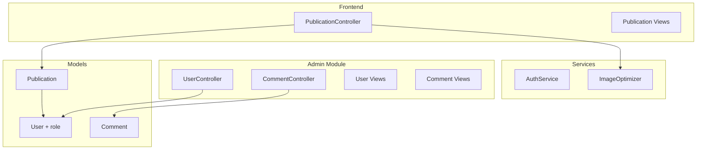

# Design Document: Публикация контента авторами и управление пользователями

## Overview

Система расширяет функциональность блог-платформы, добавляя:
1. Систему ролей пользователей (user, author, admin)
2. Управление пользователями в админ-панели
3. Возможность создания и редактирования публикаций авторами
4. Интерфейс "Мои публикации" для авторов
5. Улучшенную модерацию комментариев (view уже существует, нужна ссылка в меню)
6. Навигацию для авторов

## Architecture



## Components and Interfaces

### 1. Расширение модели User

Добавление поля `role` в таблицу `user`:

```php
// Константы ролей
const ROLE_USER = 'user';
const ROLE_AUTHOR = 'author';
const ROLE_ADMIN = 'admin';

// Методы проверки ролей
public function isAdmin(): bool
public function isAuthor(): bool
public function canCreatePublication(): bool
public function canEditPublication(Publication $publication): bool
```

### 2. PublicationController (Frontend)

Расширение существующего контроллера:

```php
class PublicationController extends Controller
{
    // Существующие actions
    public function actionIndex()  // Список публикаций
    public function actionView($slug)  // Просмотр публикации
    
    // Новые actions
    public function actionCreate()  // Создание публикации (author/admin)
    public function actionUpdate($id)  // Редактирование публикации
    public function actionDelete($id)  // Удаление публикации
    public function actionMy()  // Список публикаций автора
}
```

### 3. UserController (Admin)

Новый контроллер в админ-модуле:

```php
class UserController extends Controller
{
    public function actionIndex()  // Список пользователей
    public function actionView($id)  // Просмотр пользователя
    public function actionUpdate($id)  // Редактирование пользователя
    public function actionDelete($id)  // Удаление пользователя
}
```

### 4. Формы

```php
// Форма создания/редактирования публикации
class PublicationForm extends Model
{
    public $title;
    public $slug;
    public $content;
    public $excerpt;
    public $category_id;
    public $tagIds;
    public $featured_image;
    public $status;
}

// Форма редактирования пользователя (админ)
class UserEditForm extends Model
{
    public $username;
    public $email;
    public $role;
    public $status;
}
```

## Data Models

### Миграция: добавление роли в user

```sql
ALTER TABLE user ADD COLUMN role VARCHAR(20) DEFAULT 'user' NOT NULL;
CREATE INDEX idx-user-role ON user (role);
UPDATE user SET role = 'admin' WHERE id = 1;
```

### Структура ролей

| Роль | Права |
|------|-------|
| user | Просмотр, комментирование, закладки |
| author | + создание/редактирование своих публикаций |
| admin | + редактирование любых публикаций, управление пользователями, модерация |

## Error Handling

| Ситуация | Код | Сообщение |
|----------|-----|-----------|
| Нет прав на создание публикации | 403 | "У вас нет прав для создания публикаций" |
| Нет прав на редактирование | 403 | "Вы можете редактировать только свои публикации" |
| Публикация не найдена | 404 | "Публикация не найдена" |
| Пользователь не найден | 404 | "Пользователь не найден" |
| Нет доступа к админке | 403 | "Доступ запрещён" |

## Testing Strategy

### Unit тесты
- `UserTest::testRoleChecks()` — проверка методов isAdmin(), isAuthor(), canCreatePublication()
- `PublicationTest::testAuthorAccess()` — проверка прав доступа к публикациям

### Functional тесты
- `PublicationCreateCest` — создание публикации автором
- `PublicationEditCest` — редактирование своей/чужой публикации
- `AdminUserCest` — управление пользователями в админке

## UI/UX Design

### Навигация для авторов

В header для авторизованных авторов/админов:
```html
<nav>
    <a href="/publication/my">Мои публикации</a>
    <a href="/publication/create" class="btn">Написать статью</a>
</nav>
```

### Форма создания публикации

Поля формы:
- Заголовок (title) — обязательное
- URL (slug) — автогенерация из заголовка
- Краткое описание (excerpt) — textarea
- Содержимое (content) — WYSIWYG редактор или textarea
- Категория (category_id) — select
- Теги (tagIds) — multiple select или checkboxes
- Обложка (featured_image) — file upload
- Статус (status) — radio: черновик/опубликовано

### Страница "Мои публикации"

Таблица с колонками:
- Заголовок (ссылка на редактирование)
- Статус (badge)
- Дата создания
- Просмотры
- Комментарии
- Действия (редактировать, удалить)

### Админка: Управление пользователями

Таблица с колонками:
- ID
- Username
- Email
- Роль (badge)
- Статус (badge)
- Дата регистрации
- Действия (редактировать, удалить)

### Админка: Модерация комментариев

Уже реализовано в `modules/admin/controllers/CommentController.php` и `modules/admin/views/comment/index.php`.
Нужно добавить ссылку в меню админки.

## File Structure

```
controllers/
  PublicationController.php  # Расширить существующий

models/
  User.php  # Добавить role и методы проверки
  PublicationForm.php  # Новая форма
  UserEditForm.php  # Новая форма

modules/admin/
  controllers/
    UserController.php  # Новый контроллер
  views/
    user/
      index.php
      update.php
    layouts/
      main.php  # Добавить ссылки на User и Comment

views/
  publication/
    create.php  # Новый view
    update.php  # Новый view
    my.php  # Новый view
  layouts/
    main.php  # Обновить навигацию

migrations/
  m250701_xxxxxx_add_role_to_user.php
```
