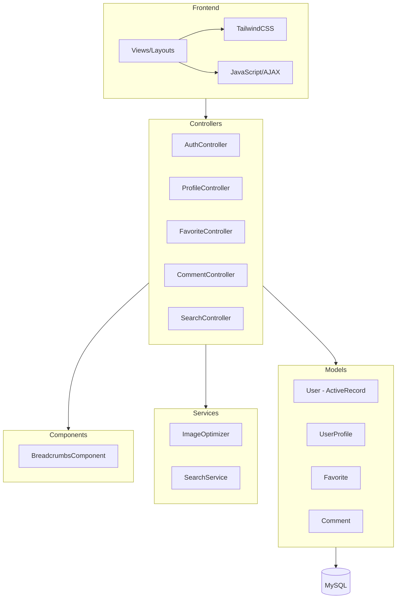

# Design Document: User Features

## Обзор

Расширение Yii2 блог-платформы системой авторизации с хранением в БД, профилями пользователей, закладками, оптимизацией изображений, комментариями с модерацией, хлебными крошками и поиском с автодополнением.

## Архитектура



## Компоненты и интерфейсы

### 1. AuthController

```php
namespace app\controllers;

class AuthController extends Controller
{
    public function actionLogin(): string|Response;      // GET/POST /login
    public function actionRegister(): string|Response;  // GET/POST /register
    public function actionLogout(): Response;           // POST /logout
}
```

### 2. ProfileController

```php
namespace app\controllers;

class ProfileController extends Controller
{
    public function actionView(string $username): string;           // GET /profile/{username}
    public function actionEdit(string $username): string|Response;  // GET/POST /profile/{username}/edit
    public function actionPassword(string $username): string|Response; // GET/POST /profile/{username}/password
    public function actionFavorites(string $username): string;      // GET /profile/{username}/favorites
}
```

### 3. FavoriteController (API)

```php
namespace app\controllers;

class FavoriteController extends Controller
{
    public function actionToggle(int $id): array;  // POST /api/favorite/toggle/{id} - AJAX
}
```

### 4. CommentController

```php
namespace app\controllers;

class CommentController extends Controller
{
    public function actionCreate(int $publicationId): array|Response;  // POST - AJAX/Form
}
```

### 5. SearchController (API)

```php
namespace app\controllers;

class SearchController extends Controller
{
    public function actionAutocomplete(string $q): array;  // GET /api/search/autocomplete
    public function actionIndex(string $q): string;        // GET /search
}
```

### 6. ImageOptimizer Service

```php
namespace app\services;

interface ImageOptimizerInterface
{
    public function optimize(string $sourcePath, array $options = []): string;
    public function createThumbnails(string $sourcePath): array;
    public function convertToWebp(string $sourcePath, int $quality = 85): string;
    public function delete(string $path): bool;
}

class ImageOptimizer implements ImageOptimizerInterface
{
    const SIZE_SMALL = [150, 150];
    const SIZE_MEDIUM = [400, 300];
    const SIZE_LARGE = [800, 600];
    const MAX_WIDTH = 1920;
}
```

### 7. Breadcrumbs Component

```php
namespace app\components;

class Breadcrumbs extends \yii\base\Component
{
    public static function build(array $items): array;
    public static function forPublication(Publication $publication): array;
    public static function forCategory(Category $category): array;
    public static function forProfile(User $user): array;
}
```

## Модели данных

### User (ActiveRecord) - Замена текущей модели

```php
/**
 * @property int $id
 * @property string $username
 * @property string $email
 * @property string $password_hash
 * @property string $auth_key
 * @property string|null $access_token
 * @property int $status (0=inactive, 1=active, 2=banned)
 * @property string $created_at
 * @property string $updated_at
 */
class User extends ActiveRecord implements IdentityInterface
```

### UserProfile

```php
/**
 * @property int $id
 * @property int $user_id
 * @property string|null $display_name
 * @property string|null $avatar
 * @property string|null $bio
 * @property string $created_at
 * @property string $updated_at
 */
class UserProfile extends ActiveRecord
```

### Favorite

```php
/**
 * @property int $id
 * @property int $user_id
 * @property int $publication_id
 * @property string $created_at
 */
class Favorite extends ActiveRecord
```

### Comment

```php
/**
 * @property int $id
 * @property int $publication_id
 * @property int|null $user_id
 * @property string|null $guest_name
 * @property string|null $guest_email
 * @property string $content
 * @property int $rating (1-5)
 * @property string $status (pending, approved, rejected, spam)
 * @property string $ip_address
 * @property string $created_at
 * @property string $updated_at
 */
class Comment extends ActiveRecord
```

### Миграции БД

```sql
-- m250101_100001_create_user_table
CREATE TABLE user (
    id INT PRIMARY KEY AUTO_INCREMENT,
    username VARCHAR(50) UNIQUE NOT NULL,
    email VARCHAR(255) UNIQUE NOT NULL,
    password_hash VARCHAR(255) NOT NULL,
    auth_key VARCHAR(32) NOT NULL,
    access_token VARCHAR(255),
    status TINYINT DEFAULT 1,
    created_at DATETIME DEFAULT CURRENT_TIMESTAMP,
    updated_at DATETIME DEFAULT CURRENT_TIMESTAMP ON UPDATE CURRENT_TIMESTAMP,
    INDEX idx_username (username),
    INDEX idx_email (email),
    INDEX idx_status (status)
);

-- m250101_100002_create_user_profile_table
CREATE TABLE user_profile (
    id INT PRIMARY KEY AUTO_INCREMENT,
    user_id INT NOT NULL,
    display_name VARCHAR(100),
    avatar VARCHAR(255),
    bio TEXT,
    created_at DATETIME DEFAULT CURRENT_TIMESTAMP,
    updated_at DATETIME DEFAULT CURRENT_TIMESTAMP ON UPDATE CURRENT_TIMESTAMP,
    FOREIGN KEY (user_id) REFERENCES user(id) ON DELETE CASCADE,
    UNIQUE INDEX idx_user_id (user_id)
);

-- m250101_100003_create_favorite_table
CREATE TABLE favorite (
    id INT PRIMARY KEY AUTO_INCREMENT,
    user_id INT NOT NULL,
    publication_id INT NOT NULL,
    created_at DATETIME DEFAULT CURRENT_TIMESTAMP,
    FOREIGN KEY (user_id) REFERENCES user(id) ON DELETE CASCADE,
    FOREIGN KEY (publication_id) REFERENCES publication(id) ON DELETE CASCADE,
    UNIQUE INDEX idx_user_publication (user_id, publication_id)
);

-- m250101_100004_create_comment_table
CREATE TABLE comment (
    id INT PRIMARY KEY AUTO_INCREMENT,
    publication_id INT NOT NULL,
    user_id INT,
    guest_name VARCHAR(100),
    guest_email VARCHAR(255),
    content TEXT NOT NULL,
    rating TINYINT DEFAULT 5,
    status ENUM('pending', 'approved', 'rejected', 'spam') DEFAULT 'pending',
    ip_address VARCHAR(45),
    created_at DATETIME DEFAULT CURRENT_TIMESTAMP,
    updated_at DATETIME DEFAULT CURRENT_TIMESTAMP ON UPDATE CURRENT_TIMESTAMP,
    FOREIGN KEY (publication_id) REFERENCES publication(id) ON DELETE CASCADE,
    FOREIGN KEY (user_id) REFERENCES user(id) ON DELETE SET NULL,
    INDEX idx_publication_status (publication_id, status),
    INDEX idx_status (status)
);
```

## URL Routing

```php
// config/web.php urlManager rules
'login' => 'auth/login',
'register' => 'auth/register',
'logout' => 'auth/logout',

'profile/<username:[\w-]+>' => 'profile/view',
'profile/<username:[\w-]+>/edit' => 'profile/edit',
'profile/<username:[\w-]+>/password' => 'profile/password',
'profile/<username:[\w-]+>/favorites' => 'profile/favorites',

'api/favorite/toggle/<id:\d+>' => 'favorite/toggle',
'api/search/autocomplete' => 'search/autocomplete',
'search' => 'search/index',
```

## Обработка ошибок

| Ситуация | HTTP код | Действие |
|----------|----------|----------|
| Неверные учётные данные | 200 | Flash message + редирект на форму |
| Профиль не найден | 404 | NotFoundHttpException |
| Нет доступа к редактированию | 403 | ForbiddenHttpException |
| Невалидные данные формы | 200 | Validation errors в форме |
| AJAX ошибка | 400/500 | JSON response с error message |
| Спам-комментарий | 200 | Тихое отклонение (honeypot) |

## Стратегия тестирования

### Unit тесты
- User::validatePassword() - проверка хеширования
- ImageOptimizer::convertToWebp() - конвертация изображений
- Comment::isSpam() - детекция спама
- Breadcrumbs::build() - формирование крошек

### Functional тесты
- Регистрация с валидными/невалидными данными
- Авторизация с remember me
- Редактирование профиля владельцем
- Запрет редактирования чужого профиля
- Toggle закладки через AJAX
- Отправка комментария с honeypot

### Acceptance тесты
- Полный flow регистрации → авторизации → редактирования профиля
- Поиск с автодополнением в браузере
